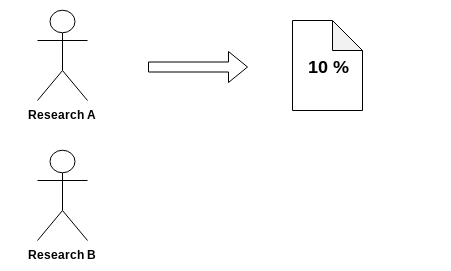
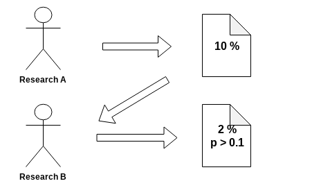
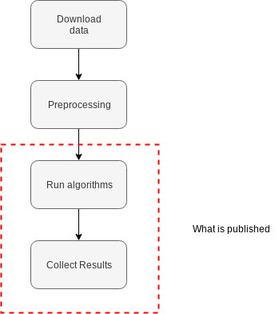
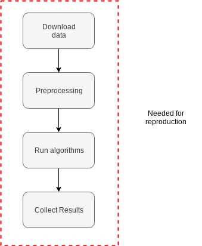
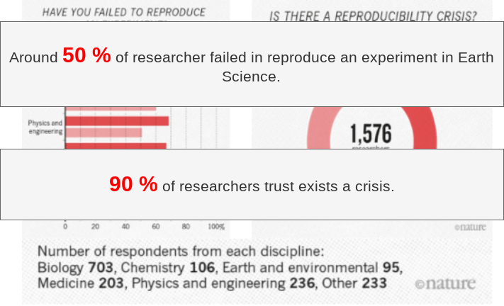
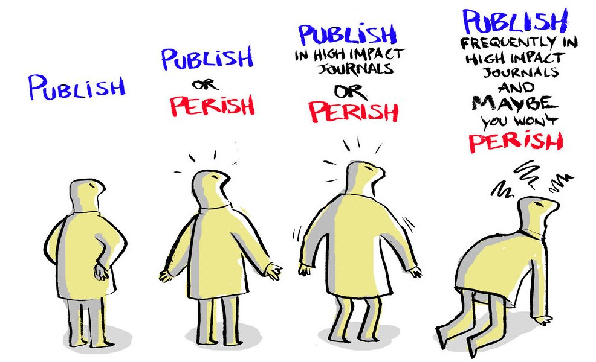
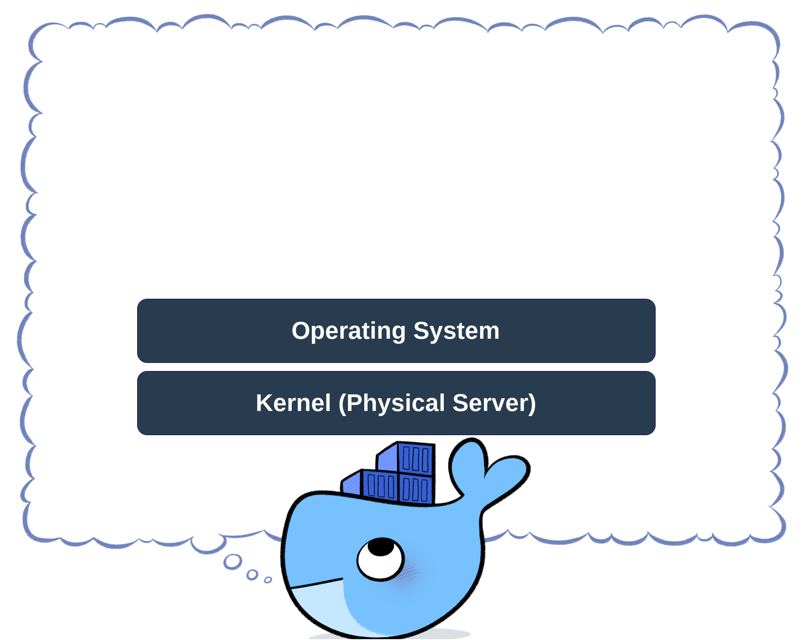
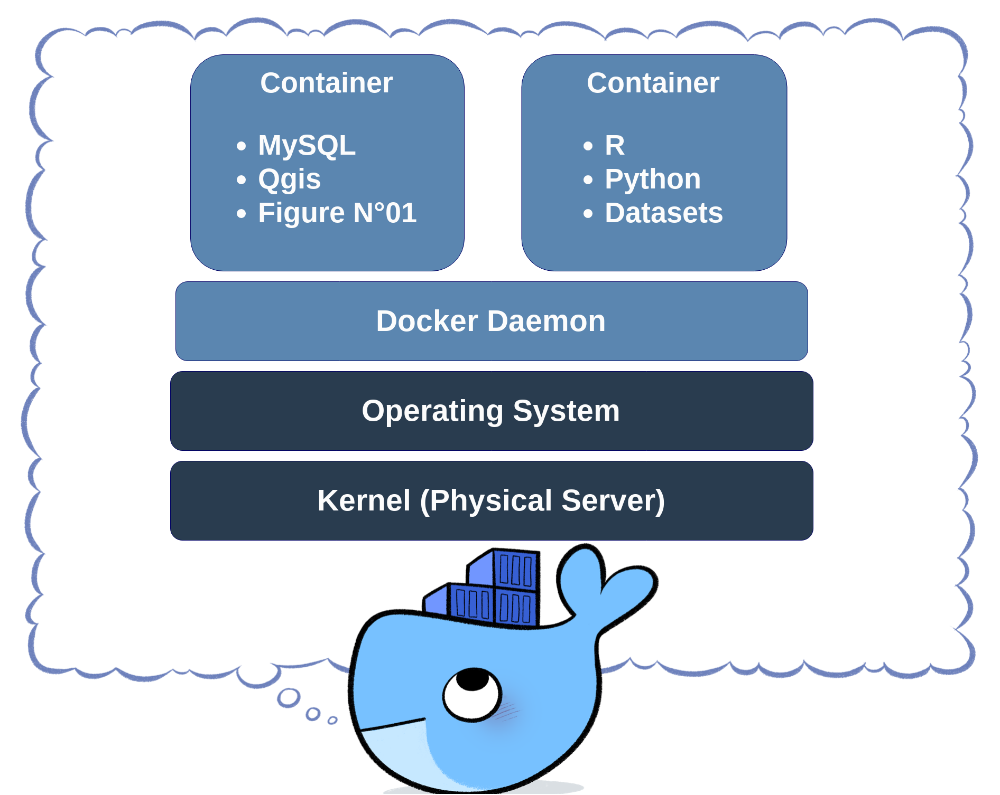
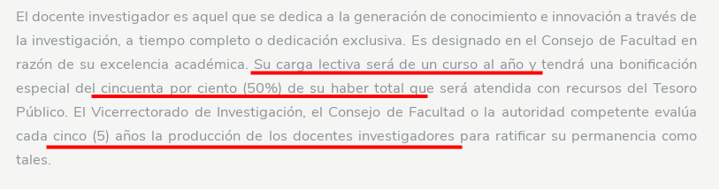

```{r setup, include=FALSE}
options(htmltools.dir.version = FALSE)
```

```{r xaringan-themer, include=FALSE}
library(xaringanthemer)

duo_accent(primary_color = "#006747", secondary_color = "#CFC493")
```

class: inverse, center, middle

# Traditional Science - Antony Barja

---

# Hello World

Install the **xaringan** package from [Github](https://github.com/yihui/xaringan):

```{r eval=FALSE, tidy=FALSE}
devtools::install_github("yihui/xaringan")
```

--

You are recommended to use the [RStudio IDE](https://www.rstudio.com/products/rstudio/), but you do not have to.

- Create a new R Markdown document from the menu `File -> New File -> R Markdown -> From Template -> Ninja Presentation`;<sup>1</sup>

--

- Click the `Knit` button to compile it;

--

- or use the [RStudio Addin](https://rstudio.github.io/rstudioaddins/)<sup>2</sup> "Infinite Moon Reader" to live preview the slides (every time you update and save the Rmd document, the slides will be automatically reloaded in RStudio Viewer.

.footnote[
[1] 中文用户请看[这份教程](http://slides.yihui.name/xaringan/zh-CN.html)

[2] See [#2](https://github.com/yihui/xaringan/issues/2) if you do not see the template or addin in RStudio.
]

---
class: inverse, center, middle

# Science in Peru - Roy Yali
---

# Hello World

Install the **xaringan** package from [Github](https://github.com/yihui/xaringan):

```{r eval=FALSE, tidy=FALSE}
devtools::install_github("yihui/xaringan")
```

--

You are recommended to use the [RStudio IDE](https://www.rstudio.com/products/rstudio/), but you do not have to.

- Create a new R Markdown document from the menu `File -> New File -> R Markdown -> From Template -> Ninja Presentation`;<sup>1</sup>

--

- Click the `Knit` button to compile it;

--

- or use the [RStudio Addin](https://rstudio.github.io/rstudioaddins/)<sup>2</sup> "Infinite Moon Reader" to live preview the slides (every time you update and save the Rmd document, the slides will be automatically reloaded in RStudio Viewer.

.footnote[
[1] 中文用户请看[这份教程](http://slides.yihui.name/xaringan/zh-CN.html)

[2] See [#2](https://github.com/yihui/xaringan/issues/2) if you do not see the template or addin in RStudio.
]


---
class: inverse, center, middle

# Reproducible Research - Cesar Aybar
---
# What is reproducible research?

`Reproducibility refers to the ability of a researcher to duplicate the results of a prior study using the same materials as were used by the original investigator.`
--
<center>

</center>

---
# What is reproducible research?

`Reproducibility refers to the ability of a researcher to duplicate the results of a prior study using the same materials as were used by the original investigator.`

<center>

</center>

---
# What is reproducible research?

`Reproducibility refers to the ability of a researcher to duplicate the results of a prior study using the same materials as were used by the original investigator.`

<center>

</center>

---
# What is reproducible research?

`Reproducibility refers to the ability of a researcher to duplicate the results of a prior study using the same materials as were used by the original investigator.`

<center>

</center>

---
# Current Earth Science Research

<center>

</center>
<br>
<br>
<br>
<br>
<br>
It is based on [Edzer Pebesma slides.](https://github.com/edzer/GEO/blob/master/GEO.pdf?fbclid=IwAR3r0CHdzkpSBjKBvw6ZoZaMzkgfEiq0mO6sUqCD9VV-OCj2hQl9wjKJlMY)

---
# Current Earth Science Research

<center>

</center>
<br>
<br>
<br>
<br>
It is based on [Edzer Pebesma slides.](https://github.com/edzer/GEO/blob/master/GEO.pdf?fbclid=IwAR3r0CHdzkpSBjKBvw6ZoZaMzkgfEiq0mO6sUqCD9VV-OCj2hQl9wjKJlMY)

---
# Current Earth Science Research

<center>

</center>
<br>
<br>
<br>
It is based on [Edzer Pebesma slides.](https://github.com/edzer/GEO/blob/master/GEO.pdf?fbclid=IwAR3r0CHdzkpSBjKBvw6ZoZaMzkgfEiq0mO6sUqCD9VV-OCj2hQl9wjKJlMY)

---
# Reproducible Crisis - I


---

# Reproducible Crisis - II



---

# Causes of the crisis

In a work published in 2015, [Glenn Begley and John Ioannidis](https://www.ahajournals.org/doi/10.1161/CIRCRESAHA.114.303819) offer **five bullets** as to summarize the present predicaments:

- Generation of new data/publications at an unprecedented rate.
- Compelling evidence that the majority of these discoveries will not stand the test of time.
- **Publish or perish**.
- This is a multifaceted, multistakeholder problem.
- No single party is solely responsible, and no single solution will suffice.

<center>

</center>

---
# Open Science

<center>

</center>

[Document here](http://publications.europa.eu/resource/cellar/3213b335-1cbc-11e6-ba9a-01aa75ed71a1.0001.02/DOC_2)

---
class: inverse, center, middle

# Some tools for implement a **R**eproducible **R**esearch pipeline.
---


# Git

<center>

</center>

[Git](https://git-scm.com/) is an Open Source Distributed Version Control System.

---
# Why git?

<center>

</center>
---
# Docker

It's an **open-source project** that automates the deployment of software applications inside containers by providing an additional layer of abstraction and automation of **OS-level virtualization on Linux**.

- Workflows transparent and reproducible.
- Lightweight.
- Easy to use.

<center>

</center>
---
# How Docker works?

<center>

</center>

---
# How Docker works?

<center>

</center>

---
# How Docker works?

<center>

</center>

---
class: inverse, center, middle

# Ingeniería Geográfica - UNMSM
---
# EAP Ingeniería Geográfica - UNMSM

Número de publicaciones científicas en revistas Q1 de los ultimos **29 AÑOS**.

```{r eval=TRUE,echo=FALSE,message=FALSE,fig.height=5,fig.align='center'}
library(tidyverse)

years <- 1990:2019
npublications <- rep(0,length(years))
npublications[29] <- 1

tibble(year = years,npub=npublications) %>% 
  ggplot(aes(x=year,y=npub)) +
  geom_line() + 
  geom_point(data = tibble(year=2018,npub=1),size = 5, colour = "red",fill='red')+
  theme_bw() + 
  scale_y_continuous(limits = c(-5, 5))+
  theme(text = element_text(size=20)) 
```
**SOLO UNA EN MAS DE 30 AÑOS** [Tarazona et.al., 2018](https://www.sciencedirect.com/science/article/pii/S1470160X18305326)

---
# EAP Ingeniería Geográfica - UNMSM

Profesor Principal e Investigador en San Marcos. **¿Cuantos y quienes son?**
<br>
<br>
<center>

</center>

http://viceacademico.unmsm.edu.pe/?page_id=5593